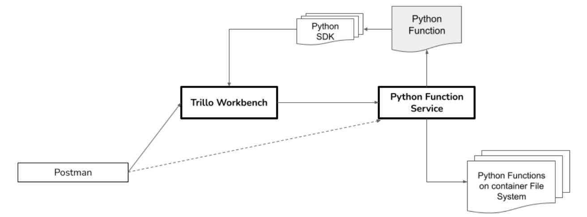

# **Trillo Workbench - Development using IDE**

This tutorial provides instructions on how to develop serverless functions for the Trillo Workbench using an Integrated Development Environment (IDE).
Trillo Workbench (WB) is a runtime to develop applications using model driven and serverless architecture. It means you specify structural parts of an application such as database, domain metadata, etc. as metadata. You add application logic using serverless functions (referred to as Trillo function). Both are deployed on the Trillo Workbench via UI or a git repository. Trillo Workbench using your code (metadata and function) makes the application functionality available.

One of the challenges of writing serverless functions is to debug them. This guide describes how to develop serverless functions for Trillo Workbench using IDE.

How to read this document to learn development of an application using Trillo Workbench?

- Follow the instructions in this document.
- Perform a few or all lessons described in this document:
  [Lessons - building application server using Trillo Workbench](https://docs.google.com/document/d/1Xs-L1gP-5fvNKkWzopm4T25yQ_v_P_heX1s8V69--Vs/edit)
- Two documents are designed to work together.


<hr style="border:0.1px solid gray">

## Understanding Trillo Functions and how they differ from Lambda or Cloud Functions
- Trillo functions use Trillo Workbench APIs and don't handle cloud APIs or database connections.
- They are deployed by Trillo Workbench, eliminating the need for CI/CD pipelines.

<hr style="border:0.1px solid gray">

## Anatomy of a Trillo Function
- Each function has structures corresponding to one endpoint, allowing for addition or removal of methods as needed.
- Trillo Workbench publishes each method as an API using a specific convention.

**ds/function/shared/{functionName}/{methodName}**

```python
from src.collager.util.api import Api


@Api(httpMethod="post")
def postMethodChangeMe(parameters):
    return parameters

```
<hr style="border:0.1px solid gray">

## Developing Using IDE
The following sections describe concepts and steps to start developing Trillo functions using IDE.

### Prerequisites for IDE Development

- Python IDE should be available on your machine. It should be using Python 3.
- You should have cloned this repository.
- The repository should be imported as a new Python project. (Make sure you don’t import it as a project or directory).
- You should have access to a Trillo Workbench running on cloud (URL, login credentials to its UI).
- You can use the same credentials to access Trillo Workbench from your client.

## How do Trillo functions run inside an IDE
- Trillo functions can run inside an IDE through an executor program,(src/io/RunFunction.py, provided in the repo).
- It reads credentials from environment variables.
  - TRILLO_WB_USER_ID
  - TRILLO_WB_USER_PASSWORD

  These credentials are the ones which are used to login to Trillo Workbench and should be set as environment variables under Configuration settings as follows:


    TRILLO_WB_USER_ID={userId};TRILLO_WB_USER_PASSWORD={password}
- The executor connects with Trillo Workbench, authenticates, and acquires an access token for API calls.
- config/Server.json contains the Trillo Workbench configuration and function details file.




## Steps to develop Trillo functions using IDE
- Create a new Python file (path:src) using IDE and copy the code below, change the class name, method name. Change HTTP method type (get, post, put, delete) in the annotation. Make sure the function inherits from the ServerlessFunction.

- Copy the following code. Replace {{placeHolderName}} with your function name and postMethodChangeMe with your method name.
```python

from src.collager.util.api import Api


@Api(httpMethod="post")
def postMethodChangeMe(parameters):
    return parameters

```
- Write your code using Trillo Workbench APIs. See the references below for more info.
- Update  Trillo Workbench configuration in config/server.json. (see section below for more information).
- Specify the function detail file. (see below)
- Using RunFunction as the main class, start running or debugging.


## Configuring Trillo Workbench
- Update the Server.json file with the Trillo Workbench URL and user credentials.
- Provide the function details file, which specifies the function and method to be executed.
```json
{
   "serverUrl":"<url of your workbench instance>",
   "userId":"Defined as environment variable TRILLO_WB_USER_ID.",
   "password":"Defined as environment variable TRILLO_WB_USER_PASSWORD",
   
   "functionDetailsFile" : "config/functions/OrderService.getItems.json"
}
```
## Specifying Function Details
- Create a JSON file with the function name, method name, and parameters to be passed to the method.
- Name the file in the format <functionName>.<methodName>.json.

```json
{
  "functionName" : "OrderService",
  "methodName" : "getItems",
  "parameters" : {
  	"orderId" : 123
  }
}


```

## Running Functions in an IDE
- Copy the provided code template, change the class and method names, and ensure it inherits from ServerlessFunction.
- Write your code using Trillo Workbench APIs.
- Update the Server.json file and specify the function details file.
- Set RunFunction as the main class and start running or debugging.

<hr style="border:0.1px solid gray">

## Additional Information
- Refer to the Trillo Workbench Developer Guide for more details on the anatomy of Trillo functions and their structure.
- Utilize Trillo Workbench APIs for writing code and consult the references provided for more information.

<hr style="border:0.1px solid gray">

## References
- https://trillo.gitbook.io/trillo-workbench
